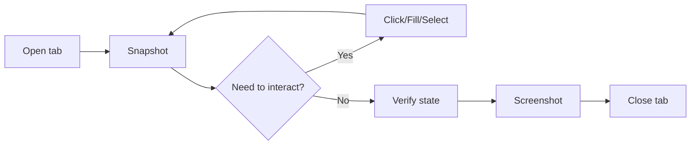

# Browse — Interactive Browser QA

Uses the runtime's `xd://browser` device for persistent Chromium sessions.
State (cookies, tabs, session) survives between calls. For durable E2E
scripts that should exist in the test library, use `browser-test` instead.

## Quick Reference

```
# Open tab (one time, session persists)
→ xd://browser { "action": "open", "url": "https://app.com", "name": "main" }

# Snapshot (accessibility tree with element refs)
→ run code: "tab.observe()"
→ run code: "tab.ariaSnapshot()"    // ARIA YAML with [ref=eN]

# Interact by element ref or selector
→ run code: "tab.fill('aria-ref=e2', 'Alice')"
→ run code: "tab.click('aria-ref=e5')"
→ run code: "tab.select('#color', 'green')"
→ run code: "tab.screenshot()"

# Read page content
→ run code: "tab.extract('#result')"      // element text
→ run code: "await tab.evaluate(() => document.title)"

# Verify state
→ run code: "await tab.waitForSelector('.dashboard')"
→ run code: "tab.observe()"    // re-snapshot after interaction
```

## Core Workflow



---

## Pattern 1: Basic page verification
```
# 1. Open a tab
xd://browser { "action": "open", "url": "https://app.com/login" }

# 2. Snapshot — get accessibility tree with element refs
xd://browser { "action": "run", "name": "main", "code": "tab.observe()" }

# 3. Console & network — check for errors
xd://browser { "action": "run", "name": "main",
  "code": "const errs=[]; page.on('console',m=>m.type()==='error'&&errs.push(m.text())); page.on('requestfailed',r=>errs.push('NET: '+r.url())); await tab.goto('https://app.com/login'); errs" }
```
## Pattern 2: Snapshot + interact by @ref

Works like gstack browse's `$B snapshot -i` then `$B click @e3`:

```
# 1. Snapshot → get accessibility tree
xd://browser { "action": "run", "name": "main",
  "code": "tab.ariaSnapshot()" }
# Returns: - textbox "Email" [ref=e2]
#          - button "Submit" [ref=e5]

# 2. Interact by ref — refs work as selectors with "aria-ref=" prefix
xd://browser { "action": "run", "name": "main",
  "code": "await tab.fill('aria-ref=e2', 'user@test.com'); await tab.click('aria-ref=e5'); tab.screenshot()" }

# 3. Verify result
xd://browser { "action": "run", "name": "main",
  "code": "tab.observe()" }
```

**Ref lifecycle**: Refs (@e1, @e2...) are page-scoped and change on
navigation or DOM mutations. Re-observe after every navigation.
## Pattern 3: Form fill and submit

```
xd://browser { "action": "run", "name": "main", "code": "
  await tab.fill('input[type=text], [contenteditable]', 'Alice');
  await tab.select('select', 'green');
  await tab.click('button, [type=submit]');
  await tab.waitForSelector('#result');
  tab.extract('#result')
" }
```
## Pattern 4: Screenshot evidence

```
# Full page screenshot (returns path)
xd://browser { "action": "run", "name": "main",
  "code": "tab.screenshot()" }

# Element screenshot
xd://browser { "action": "run", "name": "main",
  "code": "tab.screenshot({ selector: '.dashboard' })" }
```

Screenshot paths are printed in the response. The Read tool can display
the PNG to the user.

## Pattern 5: Dialog handling

```
# Auto-accept dialogs at open time
xd://browser { "action": "open", "url": "...", "dialogs": "accept", "name": "main" }

# Or per-run
xd://browser { "action": "run", "name": "main", "code": "
  page.on('dialog', d => d.accept());
  await tab.click('#delete-btn');
" }
```

## Pattern 6: Multi-tab testing

```
# Open two tabs
xd://browser { "action": "open", "url": "https://app.com/page1", "name": "tab1" }
xd://browser { "action": "open", "url": "https://app.com/page2", "name": "tab2" }

# Switch by name
xd://browser { "action": "run", "name": "tab1", "code": "tab.observe()" }
xd://browser { "action": "run", "name": "tab2", "code": "tab.observe()" }

# Close tab
xd://browser { "action": "close", "name": "tab1" }
```

## Pattern 7: Viewport/responsive

```
# Set viewport at open time
xd://browser { "action": "open", "url": "...",
  "viewport": { "width": 375, "height": 812 },
  "name": "mobile" }
```

## Pattern 8: Custom JS evaluation

```
xd://browser { "action": "run", "name": "main", "code": "
  const result = await tab.evaluate(() => {
    return {
      title: document.title,
      url: location.href,
      html: document.querySelector('main').innerHTML.length
    };
  });
  result
" }
```

## Pattern 9: Wait conditions and timeouts

```
# Wait for element to appear
xd://browser { "action": "run", "name": "main", "code": "
  await tab.waitForSelector('.toast-success', { timeout: 5000 });
  'found it'
" }

# Wait for URL change
xd://browser { "action": "run", "name": "main", "code": "
  await tab.click('button');
  await tab.waitForUrl('**/dashboard');
  tab.screenshot()
" }
```

## Pattern 10: Full QA workflow (complete dogfood)

```
# 1. Open
xd://browser { "action": "open", "url": "https://app.com/login", "name": "main" }

# 2. Check console errors + observe
xd://browser { "action": "run", "name": "main", "code": "
  const errs = [];
  page.on('console', m => m.type() === 'error' && errs.push(m.text()));
  page.on('requestfailed', r => errs.push('NET '+r.url()));
  tab.observe()
" }

# 3. Fill form and submit
xd://browser { "action": "run", "name": "main", "code": "
  await tab.fill('aria-ref=e1', 'user@test.com');
  await tab.fill('aria-ref=e2', 'password123');
  await tab.click('aria-ref=e3');
  tab.screenshot()
" }

# 4. Verify authenticated state
xd://browser { "action": "run", "name": "main", "code": "
  const url = page.url();
  const heading = tab.extract('h1');
  const shot = tab.screenshot();
  { url, heading, shot, consoleErrors: [] }
" }

# 5. Close
xd://browser { "action": "close", "name": "main" }
```

---

## Advanced: Snapshot diff, annotation, CSS

```
# Before/after diff — extract text before and after an action
xd://browser { "action": "run", "name": "main",
  "code": "const b=await tab.extract('body'); await tab.click('#btn');"+
    "const a=await tab.extract('body'); {b:b.slice(0,200), a:a.slice(0,200)}" }

# Annotated screenshot — draw red boxes around interactive elements
xd://browser { "action": "run", "name": "main", "code": "
  const el = document.createElement('div');
  el.style.cssText = 'position:fixed;inset:0;pointer-events:none;z-index:99999';
  document.body.appendChild(el);
  document.querySelectorAll('button,a,input,select').forEach((e,i) => {
    const r = e.getBoundingClientRect();
    const b = document.createElement('div');
    b.style.cssText = 'position:absolute;border:2px solid red;background:rgba(255,0,0,0.08)';
    Object.assign(b.style, {left:r.left+'px', top:r.top+'px', width:r.width+'px', height:r.height+'px'});
    const l = Object.assign(document.createElement('span'), {textContent:'@e'+(i+1)});
    l.style.cssText = 'position:absolute;top:-16px;left:0;background:red;color:#fff;font:10px monospace;padding:1px 3px';
    b.appendChild(l); el.appendChild(b);
  });
  const p = await tab.screenshot({ silent: true }); el.remove(); p
" }

# CSS inspection — computed styles via evaluate
xd://browser { "action": "run", "name": "main",
  "code": "tab.evaluate(() => { const el=document.querySelector('.el');"+
    "if(!el)return; const cs=getComputedStyle(el);"+
    "return ['color','background-color','font-size','display','margin','padding',"+
    "'border','opacity'].reduce((o,k)=>{o[k]=cs.getPropertyValue(k);return o;},{}) })" }
```

## Reference: xd://browser API map
| gstack browse | xd://browser equivalent |
|---|---|
| `$B goto url` | `open` with `url` |
| `$B snapshot -i` | `tab.ariaSnapshot()` |
| `$B fill @e2 "v"` | `tab.fill('aria-ref=e2', 'v')` |
| `$B click @e3` | `tab.click('aria-ref=e3')` |
| `$B select @e4 v` | `tab.select('aria-ref=e4', 'v')` |
| `$B text` | `tab.extract('body')` |
| `$B is visible 'x'` | `tab.waitForSelector('x', {timeout:100})` |
| `$B screenshot` | `tab.screenshot()` |
| `$B js 'expr'` | `tab.evaluate('expr')` |
| `$B console` | `page.on('console', ...)` in `run` code |
| `$B tabs` | Multiple `name` on `open` |

## Gotchas

- **`tab.fill` does NOT work on `<select>`** — use `tab.select` instead.
- **Navigation invalidates refs** — always `tab.observe()` after `goto` or
  a click that moves to a new page.
- **`tab.waitForNavigation` must start BEFORE the trigger click** — set it
  up in the same `run` call.
- **Screenshot path is returned, not passed** — `tab.screenshot()` returns
  the path; the `silent: true` option suppresses auto-display.
- **Code runs with full Node access** — scoped to the `run` call, no
  sandbox. Don't execute untrusted page content.
- **stalled actions fail fast** — don't add sleep/retry loops; the tool
  handles timeouts internally.

## When to use which

| Need | Tool |
|---|---|
| Quick interactive verification | `browse` skill (this one) |
| Durable re-runnable E2E test | `browser-test` skill |
| Static content read | `read` tool (no browser needed) |
| Complex auth / CAPTCHA | `setup-browser-cookies` then `browse` |
