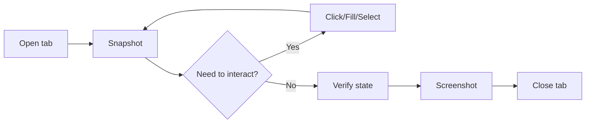

# Browse — Interactive Browser QA

Uses the runtime's `xd://browser` device for persistent Chromium sessions.
State (cookies, tabs, session) survives between calls. For durable E2E
scripts that should exist in the test library, use `browser-test` instead.

## Quick Reference

```
# Open tab (one time, session persists)
xd://browser { "action": "open", "url": "https://app.com", "name": "main" }

# Snapshot (accessibility tree with element refs)
run code: tab.observe()       # plain tree
run code: tab.ariaSnapshot()  # ARIA YAML with [ref=eN]

# Interact by element ref or selector
run code: tab.fill('aria-ref=e2', 'Alice')
run code: tab.click('aria-ref=e5')
run code: tab.select('#color', 'green')
run code: tab.screenshot()

# Read page content
run code: tab.extract('#result')
run code: await tab.evaluate(() => document.title)

# Verify state
run code: await tab.waitForSelector('.dashboard')
run code: tab.observe()       # re-snapshot after interaction
```

## Core Workflow



## Pattern 1: Basic page verification
```
# 1. Open a tab
xd://browser { "action": "open", "url": "https://app.com/login" }
# 2. Snapshot
xd://browser { "action": "run", "name": "main", "code": "tab.observe()" }
# 3. Console & network errors
xd://browser { "action": "run", "name": "main",
  "code": "const errs=[]; page.on('console',m=>m.type()==='error'&&errs.push(m.text())); page.on('requestfailed',r=>errs.push('NET: '+r.url())); await tab.goto('https://app.com/login'); errs" }
```

## Pattern 2: Snapshot + interact by @ref
```
# Snapshot → ARIA tree with refs
xd://browser { "action": "run", "name": "main", "code": "tab.ariaSnapshot()" }
# Interact — refs work as aria-ref=eN selectors
xd://browser { "action": "run", "name": "main",
  "code": "await tab.fill('aria-ref=e2', 'user@test.com'); await tab.click('aria-ref=e5'); tab.screenshot()" }
# Re-snapshot to verify
xd://browser { "action": "run", "name": "main", "code": "tab.observe()" }
```
Refs invalidate on navigation — re-observe after every `goto`.

## Pattern 3: Form fill and submit
```
xd://browser { "action": "run", "name": "main", "code": "
  await tab.fill('input[type=text]', 'Alice');
  await tab.select('select', 'green');
  await tab.click('button');
  await tab.waitForSelector('#result');
  tab.extract('#result')
" }
```

## Pattern 4: Screenshot evidence
```
# Full page (returns path in response)
xd://browser { "action": "run", "name": "main",
  "code": "tab.screenshot()" }
# Element only
xd://browser { "action": "run", "name": "main",
  "code": "tab.screenshot({ selector: '.dashboard' })" }
```
Use the Read tool to display the returned PNG path.

## Pattern 5: Dialog handling
```
# Auto-accept at open time
xd://browser { "action": "open", "url": "...", "dialogs": "accept", "name": "main" }
# Per-run listener
xd://browser { "action": "run", "name": "main", "code": "
  page.on('dialog', d => d.accept());
  await tab.click('#delete-btn');
" }
```

## Pattern 6: Multi-tab testing
```
# Open two tabs
xd://browser { "action": "open", "url": "https://app.com/a", "name": "tab1" }
xd://browser { "action": "open", "url": "https://app.com/b", "name": "tab2" }
# Switch by name
xd://browser { "action": "run", "name": "tab1", "code": "tab.observe()" }
# Close
xd://browser { "action": "close", "name": "tab1" }
```

## Pattern 7: Viewport/responsive
```
xd://browser { "action": "open", "url": "...",
  "viewport": { "width": 375, "height": 812 }, "name": "mobile" }
```

## Pattern 8: Custom JS evaluation
```
xd://browser { "action": "run", "name": "main", "code": "
  const result = await tab.evaluate(() => ({
    title: document.title, url: location.href
  }));
  result
" }
```

## Pattern 9: Wait conditions
```
# Element appears
xd://browser { "action": "run", "name": "main", "code": "
  await tab.waitForSelector('.toast-success', { timeout: 5000 }); 'found it'
" }
# URL changes after click
xd://browser { "action": "run", "name": "main", "code": "
  await tab.click('button');
  await tab.waitForUrl('**/dashboard');
  tab.screenshot()
" }
```

## Pattern 10: Full QA workflow
```
# 1. Open
xd://browser { "action": "open", "url": "https://app.com/login", "name": "main" }
# 2. Console errors + observe
xd://browser { "action": "run", "name": "main", "code": "
  const errs = [];
  page.on('console', m => m.type() === 'error' && errs.push(m.text()));
  page.on('requestfailed', r => errs.push('NET '+r.url()));
  tab.observe()
" }
# 3. Fill + submit + screenshot
xd://browser { "action": "run", "name": "main", "code": "
  await tab.fill('aria-ref=e1', 'user@test.com');
  await tab.fill('aria-ref=e2', 'password123');
  await tab.click('aria-ref=e3');
  tab.screenshot()
" }
# 4. Verify result
xd://browser { "action": "run", "name": "main", "code": "
  { url: page.url(), heading: await tab.extract('h1'), screenshot: await tab.screenshot() }
" }
# 5. Close
xd://browser { "action": "close", "name": "main" }
```

## Pattern 11: File upload
```
xd://browser { "action": "run", "name": "main",
  "code": "await tab.uploadFile('input[type=file]', '/path/to/file.pdf'); 'uploaded'" }
```

## Pattern 12: Drag and drop
```
xd://browser { "action": "run", "name": "main",
  "code": "await tab.drag('#source', '#target'); 'dragged'" }
```

## Pattern 13: Cookie and storage manipulation
```
# Set/get/clear cookies via evaluate
xd://browser { "action": "run", "name": "main",
  "code": "tab.evaluate(() => { document.cookie='session=abc123;path=/';"+
    "localStorage.setItem('pref','dark');"+
    "return {cookies:document.cookie,storage:{...localStorage}} })" }
```

## Pattern 14: Wait for network response
```
xd://browser { "action": "run", "name": "main", "code": "
  const [resp] = await Promise.all([
    tab.waitForResponse(r => r.url().includes('/api/submit')),
    tab.click('#submit-btn')
  ]);
  { status: resp.status(), url: resp.url(), ok: resp.ok() }
" }
```

## Pattern 15: Scroll element into view
```
xd://browser { "action": "run", "name": "main",
  "code": "await tab.scrollIntoView('#footer'); 'scrolled'" }
```

## Advanced patterns

For snapshot diff, annotated screenshots, CSS inspection, page cleanup,
and URL content comparison, load:

```md
${CLAUDE_PLUGIN_ROOT}/skills/browse/references/advanced-patterns.md
```

## Reference: xd://browser API map
| gstack browse | xd://browser equivalent |
|---|---|
| `$B goto url` | `open` with `url` |
| `$B snapshot -i` | `tab.ariaSnapshot()` |
| `$B fill @e2 "v"` | `tab.fill('aria-ref=e2', 'v')` |
| `$B click @e3` | `tab.click('aria-ref=e3')` |
| `$B select @e4 v` | `tab.select('aria-ref=e4', 'v')` |
| `$B text` | `tab.extract('body')` |
| `$B is visible 'x'` | `tab.waitForSelector('x', {timeout:100})` |
| `$B screenshot` | `tab.screenshot()` |
| `$B js 'expr'` | `tab.evaluate('expr')` |
| `$B console` | `page.on('console', ...)` in `run` code |
| `$B tabs` | Multiple `name` on `open` |

## Gotchas
- **`tab.fill` does NOT work on `<select>`** — use `tab.select` instead.
- **Navigation invalidates refs** — always `tab.observe()` after `goto` or
  a click that moves to a new page.
- **`tab.waitForNavigation` must start BEFORE the trigger click** — set it
  up in the same `run` call.
- **Screenshot path is returned, not passed** — `tab.screenshot()` returns
  the path; `silent: true` suppresses auto-display.
- **Code runs with full Node access** — no sandbox. Don't execute untrusted
  page content.
- **Stalled actions fail fast** — don't add sleep/retry loops.

## When to use which
| Need | Tool |
|---|---|
| Quick interactive verification | `browse` (this skill) |
| Durable re-runnable E2E test | `browser-test` skill |
| Static content read | `read` tool (no browser needed) |
| Complex auth / CAPTCHA | `setup-browser-cookies` then `browse` |
